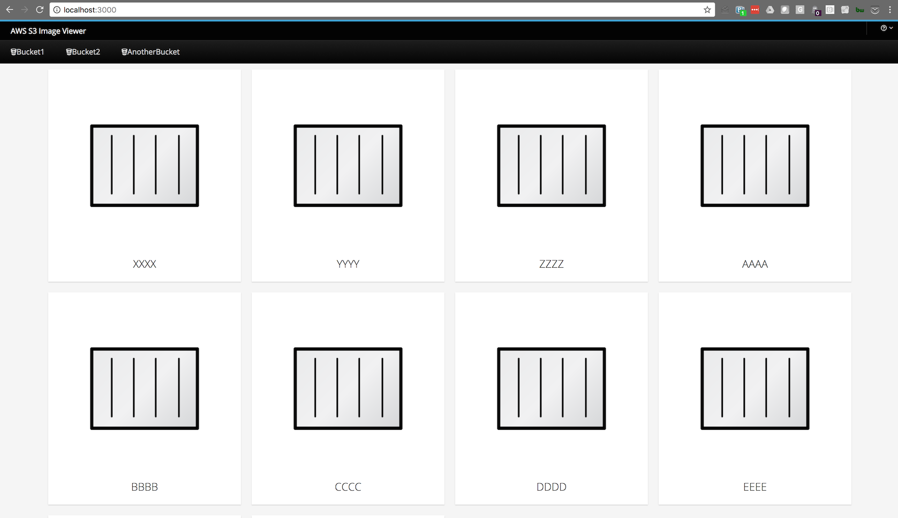

# S3 Image Viewer App
It's a pretty basic webapp that formats and showcases a list of images from an AWS S3 bucket.

## THIS IS IN-WORK, YMMV.

Here's a screenshot:


## About the code
It's node.js it talks to S3 and it uses [patternfly](http://www.patternfly.org/) for the UI.

## How to use this service
1. ```npm install```
2. ```npm start```

### On OpenShift
```oc new-app https://github.com/dudash/s3-image-viewer-webapp.git```

You will need to a few environment variables to point your service to your AWS S3 source and configure preferences.
* Bucket Names - TBD
* Image Extension Filtering - TBD
* Credentials for accessing private buckets - TBD

## Want to help out?
Follow the guidelines in the [CONTRIBUTING](./CONTRIBUTING.md) doc